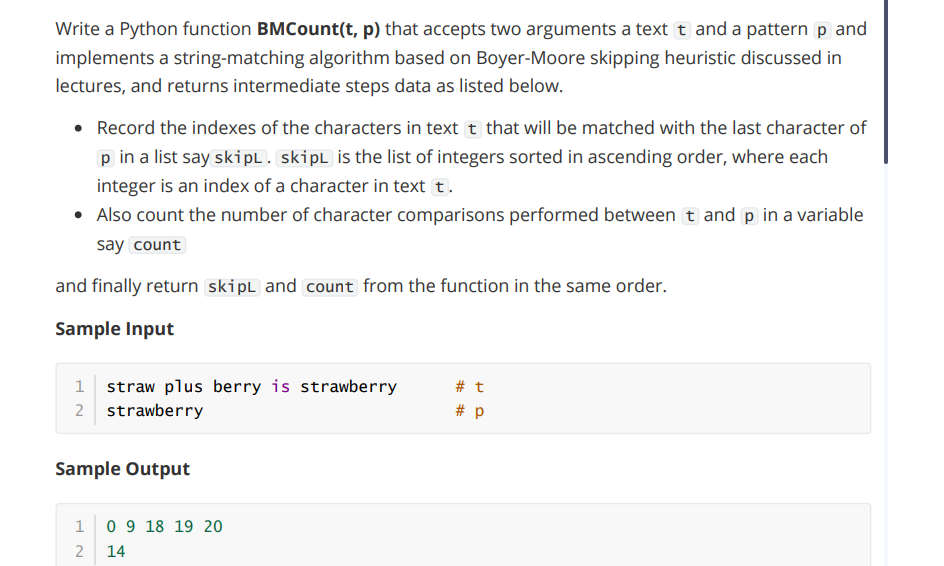

## Week 10 

- ### PPA1


-   ## Solution code
```
def BMCount(t,p):
  last = {} # Preprocess
  for i in range(len(p)):
    last[p[i]] = i
  poslist,i, count = [], 0, 0 # Loop
  
  while i <= (len(t)-len(p)):
    matched,j = True,len(p)-1
    poslist.append(i)
    while j >= 0 and matched:
      count += 1 
      if t[i+j] != p[j]:
        matched = False
      j = j - 1
    if matched:
      i = i + 1
    else:
      j = j + 1
      if t[i+j] in last.keys():
        i = i + max(j-last[t[i+j]],1)
      else:
        i = i + j + 1
  return poslist, count
t = input()
p = input()
list, c = BMCount(t, p)
print(*list)
print(c)
```

- Test Case 1 - Input

```
straw plus berry is strawberry
strawberry
```
```
0 9 18 19 20
14
```

- Test Case 2
Input
```
lcetcxedt dfashoxdwkevfbiztvrwh xqhjtxntfplurlpkrbpvgehojnkagvqla
ojnka

```
Expected Output

```
0 5 10 15 16 21 26 31 34 36 41 46 51 55 56
19
```
- Test Case 3 : Input
```
wrbbphtchnrpnhwqfbppqwweijdgosxztpekucgmgfYDlkBfiqbjgkfzklltmfpgptiuywcpkdzwdbmylptppeaash
YDlkBf
```
- Expected Output

```
0 6 12 18 24 30 32 38 42 43 49 50 56 61 67 69 75 78 84
26
```
- Test Case 4 Input
```
wrbbphtchnrpnhwqfbppqwweijdgosxztpekucgmgfYDlkBfiqbjgkfzklltmfpgptiuywcpkdzwdbmylptppeaash
YdlkBf
```
- Expected Output
```
0 6 12 18 24 30 32 38 44 50 56 61 67 69 75 78 84
18
```
- Test Case 5 Input
```
ncUQLceWAepfsxctbipkcskgbsb nwqmbgpqbrvrhdcetncUQLceWAghvp nmlgaez frtmpncUQLceWAdmvsrfnpagxvrj ggm bzlkezzyzznqaxqhxyrcrkj rrnhsrikkpnrcuqbcniwncUQLceWAsdmjtfstwxswonhloqrojqymfiz
ncUQLceWA
```
- Expected Output
```
0 1 3 12 15 24 33 42 45 46 55 64 72 73 82 91 100 109 118 126 134 143 144 145 154 163
58
```
