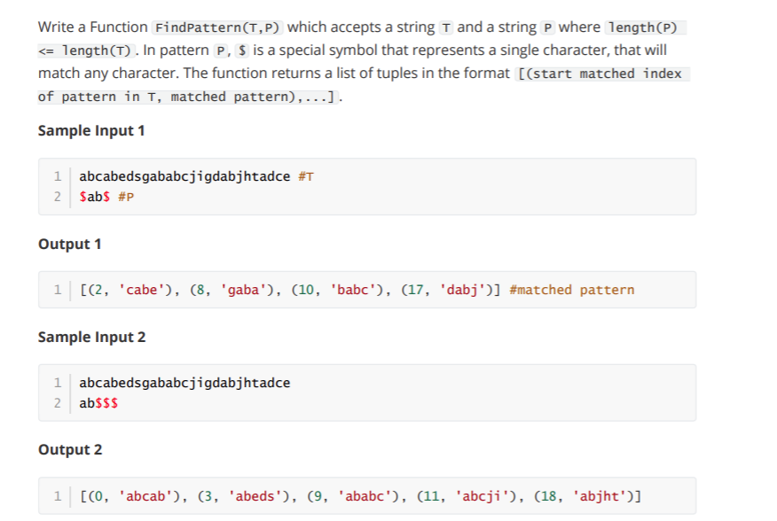

# week 10 Grpa 2



- Solution 
```
def FindPattern(T,P):
    last = {} # Preprocess
    for i in range(len(P)):
        if P[i] != '$':
            last[P[i]] = i
    poslist=[]
    i = 0 # Loop
    while i <= (len(T)-len(P)):
        matched,j = True,len(P)-1
        while j >= 0 and matched:
            if P[j] != '$':
                if T[i+j] != P[j]:
                    matched = False
            j = j - 1            
        if matched:
            poslist.append((i,T[i:i+len(P)]))
            i = i + 1
        else:
            j = j + 1
            if T[i+j] in last.keys():
                i = i + max(j-last[T[i+j]],1)
            else:
                i = i + 1
    return(poslist)
T = input()
P = input()
print(FindPattern(T,P))
```
- # Public Cases
- Test Case 1
- Input
```
abcabedsgababcjigdabjhtadce
ab$$$
```
- Expected Output
```
[(0, 'abcab'), (3, 'abeds'), (9, 'ababc'), (11, 'abcji'), (18, 'abjht')]
```
- Test Case 2
- Input
```
abcabedsgababcjigdabjhtadce
$$$$ab
```
Expected Output
```
[(5, 'edsgab'), (7, 'sgabab'), (14, 'jigdab')]
```
- Test Case 4
- Input
```
abcdef
$$ab
```
Expected Output
```
[]
```
- ## Private Case Submission Results
- Test Case 1
- Input
```
abbabaabaabbaabbaa
$$ba$
```
- Expected Output
```
[(0, 'abbab'), (2, 'babaa'), (5, 'aabaa'), (9, 'abbaa'), (13, 'abbaa')]
```
- Test Case 2
- Input
```
abcdacbdcradcebcdabccaceddebbacabbacbda
$$$ba
```
- Expected Output
```
[(25, 'debba'), (30, 'cabba')]
```
- Test Case 3
- Input
```
abcdefghij
ij$$
```
- Expected Output
```
[]
```
- Test Case 4
- Input
```
abcdacbdcradcebcdabccaceddebbacabbacbdadbbcca
$d$b$c$
```
- Expected Output
```
[(15, 'cdabcca'), (38, 'adbbcca')]
```

- Test Case 5
- Input
```
abccbaabcbacacbaabbccabcaaccbbacbacbacbbcacbacbca
$$$$$ba$$$
```
- Expected output
```
[(4, 'baabcbacac'), (9, 'bacacbaabb'), (24, 'aaccbbacba'), (27, 'cbbacbacba'), (30, 'acbacbacbb'), (38, 'bbcacbacbc')]
```