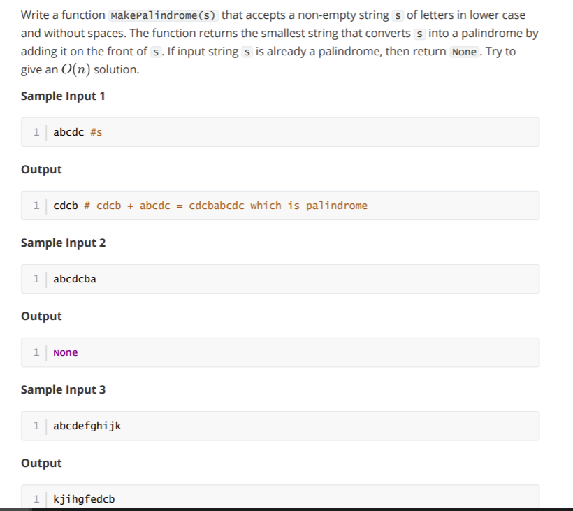

# week 10 grpa 3



- ## Solution 

```
def kmp_fail(p):
# Initialize
    m = len(p)
    fail = [0 for i in range(m)]
# Update
    j,k = 1,0
    while j < m:
        if p[j] == p[k]: #k+1 chars match
            fail[j] = k+1
            j,k = j+1,k+1
        elif k > 0: #find shorter prefix
            k = fail[k-1]
        else: #no match found at j
            j = j+1
    return(fail[-1])

def MakePalindrome(s):
    if len(s)==0:
        return s
    m = kmp_fail(s + '#' + s[::-1])
    if m == len(s):
        return None        
    else:
        return s[m:][::-1]
s = input()
print(MakePalindrome(s))
```

- Test Case 1
- Input
```
abcdc
```
- Expected Output
```
cdcb
```
- Test Case 2
- Input
```
abcdcba
```
- Expected Output

```
None
```
- Test Case 3 - Input
```
abcdefghijk
```
- Expected Output
```
kjihgfedcb
```
- Test Case 4 - Input
```
bcdefghijkllkjihgfedcba
```
- Expected Output
    ```
    a
    ```
 - # Private Cases Results
- Test Case 1 - Input

```
abcdefghijkllkjihgfedcba
```
- Expected Output
```
None
```
- Test Case 2 - Input
```
efghijkllkjihgfedcba
```
- Expected Output
```
abcd
```
- Test Case 3 - Input
```
abcdefghijklmnopqrstuvwxyz
```
- Expected Output
```
zyxwvutsrqponmlkjihgfedcb
```
- Test Case 4
- Input
```
abcdefghijklmnopqrstuvwxyzabcdefghijklmnopqrstuvwxyzzyxwvutsrqponmlkjihgfedcbazyxwvuts
rqponmlkjihgfedcba
```
- Expected Output

```
None
```

- Test Case 5 - Input
```
defghijklmnopqrstuvwxyzabcdefghijklmnopqrstuvwxyzzyxwvutsrqponmlkjihgfedcbazyxwvutsrqponmlkjihgfedcba
```
- Expected Output
    ```
    abc
    ```